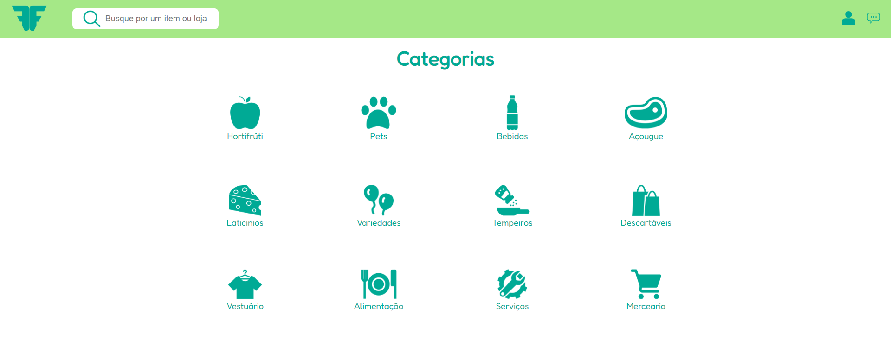

<p align="center">
  
  
  
</p>
<p align="center">
    
</p>

# Feira Fácil

Feira Fácil is a digital platform designed to help local market vendors (feirantes) digitize their sales and provide customers with greater convenience and accessibility. The platform aims to transform traditional markets by offering features that benefit both vendors and customers.

## Project Overview

Feira Fácil is a comprehensive solution for local market vendors to manage their sales online, enabling customers to easily find and purchase products. The platform provides features such as home delivery options and precise stall location information within the market, enhancing the overall market experience.

## Features

- **Vendor Management:** Easy-to-use tools for vendors to list their products, manage inventory, and track sales.
- **Online Ordering:** Customers can browse products from various vendors and place orders from the comfort of their homes.
- **Home Delivery:** Option for customers to have their purchases delivered directly to their doorstep.
- **Stall Location:** Interactive maps showing the exact location of each vendor's stall within the market.
- **Responsive Design:** Ensures a seamless experience on all devices, from desktops to mobile phones.

## Technical Details

- **Languages Used:** HTML, CSS, JavaScript
- **Frameworks and Libraries:** Utilizes modern frameworks and libraries for enhanced functionality and user experience.
- **Database Integration:** Manages vendor and product information efficiently.
- **Responsive Layout:** Employs flexible grid systems and media queries to ensure the site looks great on all screen sizes.
- **Interactive Elements:** JavaScript-powered components for dynamic content updates and user interactions.


## Try It Out

To try out the Simple Calculator locally, follow these steps:

1. **Clone the Repository:**
   ```bash
   git clone https://github.com/weslleyolli/Feira-Facil
   cd feira-facil
   open login.html